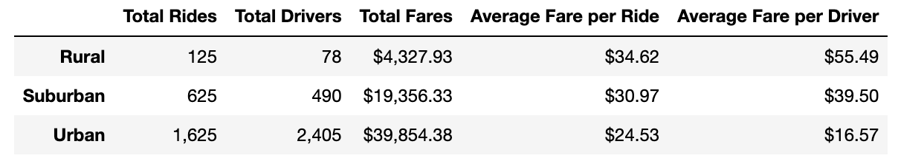
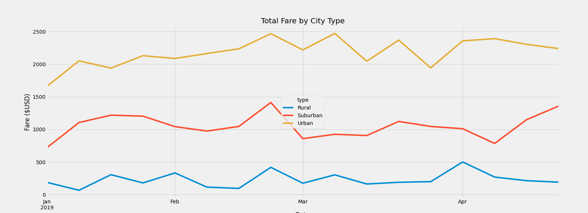

# PyBer-Analysis

## Overview
Pyber is a ride-sharing service that enables customers to get a ride to their location with a few taps on their smartphone. The company has instructed us  to use ride-sharing data from 2019 to determine relationships between the type of city (rural, suburban, or urban) and the average fare, numbers of rides, number of drivers, and other factors. This task was accomlished using python in Jupyter Notebook. The data was separated into two csv files:  and .

## Results

A dataframe was created to summarize the differences between the type of city. There are several conclusions that were made from this data:

* rural neiborhooods are the least served, while urban are the most. This is partially due to the difference in population density.
* there are more drivers in more urban cities
* the total amount of fares received is highest in urban cities, which is where more drivers and rides are located
* The average fare per ride is highest in rural areas, and smallest in urban areas
* the average fare per driver is highest in rural areas, and smallest in urban areas

The line chart below shows the weekly total fares from January - April 2019. Each line has some fluctuation, but is centered around its mean. The urban line shows the highest values, whereas the rural line shows the lowest values. The lines never intersect, meaning the weekly fares for urban and suburban cities are always higher than that of the rural areas. In the fourth week of February, each city type shows a peak in the number of fares, suggesting that demand is higher during this week. The rural areas also show a peak in the first week of February and the first week of April, as well as the second week of March. Urban areas have a similar peak in the second week of March as well. These weeks could be targeted for increasing revenue. Overall, each city type experiences a dip in weekly fares during the same weeks. 

## Summary

In order to provide more access to underserved neighborhoods, there are several action steps that can be taken in rural cities:

* Decreasing the average fare per driver by providing more drivers in rural cities
* Decreasing the average fare per ride during periods of higher demand, such as the first week in April or the fourth week of February
* During weeks of less demand in suburban cities, such as the first week of February, place idle drivers in rural areas

In order to increase revenue in general, it is advised to transfer drivers from lower-demand cities to higher-demand cities. For example, in the second week of March, demand in suburban cities is lower than usual, so the number of drivers could be decreased in this area and increased in cities with high demand for that week, which in this case would be urban cities. 
